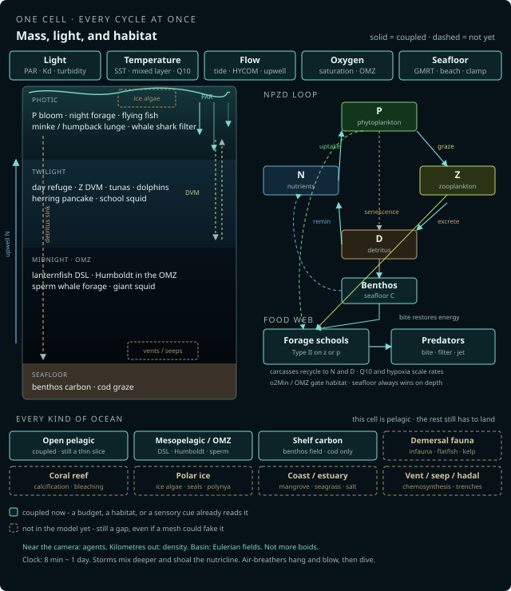

# untitled_simulation

A scientific ocean simulation. The aim is the most complete coupled ocean that can run in a browser — **every kind of ocean**, not one pretty tank. A North Sea shelf, a Humboldt upwelling cell, an Antarctic slope, a tropical gyre, a coral reef, an ice edge, a hydrothermal vent: each kilometre should be a living cell rather than a backdrop. Every factor that changes a **budget**, a **habitat**, or a **sensory cue** belongs.

The camera is a window into that system, not the point of it. There is no score, no collectible, no species that exists only to look like another species.



Solid nodes are coupled now. Dashed nodes are still open. The in-app **About** panel is the same live inventory, condensed.

```bash
npm install
npm run dev
```

Open the URL Vite prints. The **world map** is home. Click water to load that kilometre (GEBCO floor, a mean current, every catalogued animal whose range and thermal niche cover the cell). Land is not a cell. **Cells** picks a named kilometre: the 10 km catalog tank (whole catalog, stepped shelves, 2000 m) plus biomes from the coupling figure. Gap tiles still open the pelagic water at that site — they do not invent coral or a vent. Polar ice is coupled. Each named cell starts with the fauna that range would put there; names in the picker add or remove that biome’s usual cast.

The public host is a Cloudflare Worker with the Vite `dist`. Atlas paths `/gebco`, `/gmrt`, `/hycom` are the same in `npm run dev` and in production (Vite proxy locally, Worker fetch on the edge). Attach a domain: [`docs/deploy.md`](docs/deploy.md).

Controls: `M` / `Tab`. Toggles start off. Prefer a physical control (turbidity, SST anomaly, oxygen anomaly, ice anomaly) over a cosmetic one.

## Mission

Physics first, then chemistry, then life.

Light sets photosynthesis. Photosynthesis sets plankton. Plankton, temperature, and currents set where forage fish go. Forage fish set where predators hunt. Detritus sinks; the seafloor holds carbon; demersal animals eat it. If a feature does not change a budget, a habitat, or a sensory cue, it does not belong yet.

The long-term target is a single catalog plus presence plus shared budgets that can hold any ocean ecosystem — pelagic, mesopelagic, demersal, reef, polar, coastal, upwelling, vent — without a second 20k boid loop. Near the camera: agents. Kilometres out: density. Basin: Eulerian fields. The kilometre we load today is a pelagic cell; the other systems are first-class ocean, not later colour.

How to add an animal: [`.cursor/rules/species.mdc`](.cursor/rules/species.mdc). Architecture for agents: [`.cursor/rules/mission.mdc`](.cursor/rules/mission.mdc). Keep this README and the in-app About panel in the same commit as the feature: [`.cursor/rules/readme.mdc`](.cursor/rules/readme.mdc). Public deploy: [`docs/deploy.md`](docs/deploy.md).

## Glossary

The jargon the model actually uses. Same list lives in the in-app **About** panel.

| Term | Meaning |
| --- | --- |
| **PAR** | Photosynthetically active radiation. The light phytoplankton can use. Dies with depth (Beer–Lambert). Fog, caustics, growth, and visual hunt share it. |
| **Kd** | Diffuse attenuation. How fast PAR dies with depth (turbidity). Sets the 1% light depth — the photic limit. |
| **NPZD** | Nutrients, phytoplankton, zooplankton, detritus. The bloom budget. A 128×128 patch times a shared column, not a 128³ grid. |
| **DVM** | Diel vertical migration. Night near the surface to feed; day deeper as a visual refuge. |
| **OMZ** | Oxygen minimum zone. A hypoxic band below the mixed layer in eastern-boundary and tropical cells. Humboldt’s day refuge; tunas stay above their `o2Min`. |
| **DSL** | Deep scattering layer. The mesopelagic sound and biomass layer. Lanternfish in this catalog. |
| **Q10** | How much a rate changes per 10 °C. Metabolism, graze, and NPZD all scale with column temperature. |
| **SST** | Sea-surface temperature. Latitude climatology plus season plus the anomaly knob. |
| **Mixed layer** | Well-mixed surface water. Winter mixes it deeper; storms mix it deeper still. |
| **Nutricline** | The depth where nutrients increase. Climate upwell and storms shoal it so N sits in the light. |
| **Photic** | The sunlit layer, down to ~1% light. Photosynthesis lives here. |
| **Ice** | Sea-ice concentration and thickness from latitude and season. Transmission through floes plus leads. Polar night / midnight sun follow solar elevation. |
| **Benthos** | Carbon on the seafloor from sinking detritus. Cod graze that field. |
| **Type II** | Saturating graze: fast when food is scarce, capped when it is dense. |
| **GEBCO / GMRT / HYCOM** | Atlas: map tint, seafloor elevation, mean current. |
| **Vehicle** | A rare Reynolds integrator (sharks, whales, giant squid, air-breathers). Abundance is a catalog knob, not the integrator: numerous mesopredators are `school` with `diet: "bite"`. |
| **Agents / Eulerian** | Near the camera: individuals. Kilometres out: density. Basin: fields on a grid. |

## What is coupled now

The live inventory. A module is listed here only if an animal or a budget actually reads it. Field sampling: [`docs/fields.md`](docs/fields.md).

### Cell, atlas, and time

The **world map** is home. Click water to load a 1 km cell (`PATCH_SIZE_M`). Land is not a cell. Floor comes from GMRT (`/gmrt`, 80×80 elevation). Mean current from HYCOM (`/hycom`) when that service answers; otherwise the cell note says local tide and eddies only. GEBCO WMS tints the map (`/gebco`). Same-origin paths in `npm run dev` and on the Cloudflare Worker (`workers/atlas.js`).

**Cells** (`src/world/demos.js`) is a picker of named kilometres. The **catalog tank** is the 10 km lab: beach on +Z, inner shelf ~−40 m, mid-shelf ~−110 m, outer ledge ~−220 m, slope terrace ~−800 m, a canyon and a seamount, basin to −2000 m. Every catalogued animal is present. Not a biogeographic range. Coupled tiles (open pelagic, Humboldt OMZ, North Sea shelf, Antarctic slope, polar ice) load a real atlas cell when GMRT answers, or a synthetic floor if it does not. Gap tiles (demersal fauna, coral reef, coast / estuary, vent / hadal) still open the pelagic kilometre at that site so the missing biome is visible as a gap, not faked with a mesh. The picker preselects animals whose range covers the cell; toggling a name adds or removes species that are normally present in that kind of ocean.

**WorldStream** caches neighbour chunk ids (cap 8). This pass binds one cell; animals do not swim between cells.

**Clock** — one on-screen day is 480 s (~8 min). Twelve sim days per year. Live clock on by default (`L`). Hour slider pauses it. Storm (`T`) deepens the mixed layer, shoals the nutricline, and raises current speed. Night / dawn / day / dusk are a look (`src/simulation/day.js`) that also drives surface PAR and DVM. At high latitude the look follows solar elevation: polar night stays dark at noon; midnight sun stays lit at hour 0.

### Fields

Agents never get a private sun, current, temperature, or oxygen. They sample these.

| Field | What it does |
| --- | --- |
| **Seafloor** | Local height at (x, z) from the elevation grid. `CONFIG.floorY` is the cell minimum, not the slope under the animal. A dropoff or seamount is a wall. Beach, dunes, and wet mask from the same grid. |
| **Flow** `sampleFlow` | Tide, longshore, thermocline shear, synthetic eddies, optional atlas mean (east → X, north → Z). Storm multiplies speed. Climate upwell and storms add a mean **upward** lift around the mixed layer (Ekman-ish, not a HYCOM `w`). The only current — school advection, plankton, and vehicles all read it. |
| **Light** `samplePAR` | Beer–Lambert. \(I_0\) from sun elevation, night, storm, then **ice transmission** (leads plus the floe). \(K_d\) so the 1% depth matches `openPhoticY()` (turbidity). Fog, caustics, phytoplankton growth, and **visual hunt** share that envelope. `visualRange` scales detect and fear for sighted hunters; photophore prey restore a fraction in the dark. Sperm whale / orca `sense: "echo"` skip PAR. A shelf floor shallower than 1% light stays sunlit — `photicLimitY()` clips the HUD/zone, not Kd. Pack ice is an \(I_0\) skin, not Kd. Open cells clear the water (`bindColumnHabitat`). |
| **Temperature** `sampleTemp` | SST = latitude climatology + seasonal cycle + `sstAnomaly`. Mixed layer well-mixed; below it a fall toward deep water. Winter mixes deeper; **storms mix deeper still** (`thermoY`). Q10 (`columnQ10`, `productionQ10`) scales NPZD, school metabolism/graze, and vehicle drain. Catalog `temp.min` / `temp.max` gates presence. |
| **Oxygen** `sampleO2` | ml L⁻¹. Mixed layer near saturation (SST). Eastern-boundary and tropical cells get an OMZ; deep water recovers. Catalog tank forces a refuge. Detritus remineralisation is `setOxygenDemand`. `oxygenLimitY` is the hypoxia floor unless `omzRefuge`. Humboldt `o2: { needOmz }` gates presence; day DVM follows `omzCoreY`. `o2Anomaly` is a control. Tunas and sharks stay above their `o2Min`; lanternfish `o2Min` 0.08 can occupy the hole. Hypoxia raises drain (`o2MetabolicFactor`). |
| **Ice** `climateIce` | Concentration 0–1 from latitude, longitude, and season. Thickness follows concentration. `iceTransmit` is leads plus Beer–Lambert through the floe — PAR, caustics, and visual hunt all read it. Ice algae is extra P in the top ~10 m. Polar cod, krill, and silverfish `iceAssociated`: DVM shoals toward the ice–water film. Polar night / midnight sun follow solar elevation (`solarSinElev`), not a 24 h clock. `iceAnomaly` is a control. Catalog tank is ice-free. Drift, ice age, and mapped polynyas are still gaps. |
| **Upwelling** `climateUpwell` | 0–1 climate lift from eastern-boundary currents (Humboldt, California, Canary, Benguela) and the equatorial cold tongue. Gyres and the North Sea are near zero. Shoals the NPZD nutricline so N sits in the light; storms add a further lift. Catalog tank forces a visible lift. HUD reads mixed-layer and nutricline depth. |
| **NPZD** `plankton.js` | Separable 3D: \(C(x,y,z)=\mathrm{Patch}(x,z)\times\mathrm{Column}(y)\). 128×128 typed arrays `n`, `p`, `z`, `d` — not a 128³ grid. Column shape: P in the photic / DCM, Z on a DVM, N a nutricline that **shoals under climate upwell and storms**, D sinks. **Ice algae** adds P in the top ~10 m when the cell holds ice. `sampleAt` / `grazeAt` return 0 below the local seafloor. Production uses PAR × P profile; Z grazing uses P–Z column coincidence. Type II half-saturation. Carcasses and excretion return mass to `n` and `d`. |
| **Benthos** | Column-bottom detritus flux onto a 2D seafloor store. Remineralises to N. Cod `grazeBenthos` on the bed. Present in every wet cell. HUD reads mean carbon. |

Green P slices sit on the live photic bins; yellow-green Z sparkles on the DVM (`src/render/plankton.js`).

### Agents and scale

Near the camera only. One hashed-grid school (cap 20k, `UniformGrid3D`, 32768 buckets, neighbour walks on occupied cells). Vehicles are a handful of Reynolds integrators for rares and air-breathers, not a second boid loop. `gridMinY` is the deepest *present school* taxon — Humboldt and lanternfish enlarge it when they are in the cell; a sperm whale at 2 km does not.

**School** (`src/simulation/school.js`) — one hashed grid. Grazers share a bloom-capped budget, split by catalog `share`. Bite-only taxa (`diet: "bite"`) take a prey-capped slice of the same grid (`piscivorePreyRatio`, default 22 forage per piscivore). `diet: "both"` (mackerel) stays on the grazer cap and still neighbour-bites. Social modes: `polarized` (herring pancake, skipjack), `loose` (flying fish, saury, mahi, sailfish), `scatter` (lanternfish, krill, school squid, Humboldt, barracuda, cod). Type II graze on `z` unless `grazeOn: "p"` (krill, menhaden) or bite-only. Hungry shoals may rise toward food or a prey centroid; satiated shoals sit in the day refuge. `habitat: "benthic"` (cod, toothfish) hugs the local floor. `iceAssociated` (polar cod, krill, silverfish) shoals DVM toward the ice–water film when the cell holds ice. Fear: surface taxa steer up (still in water); lanternfish, Humboldt, and sand lance steer down. School squid and Humboldt pulse–coast on the grid velocity, then hang on `sampleFlow`. Sex is a size tint (females slightly larger). Recruits when the mixed budget can carry them; starve-cull recycles.

**Vehicles** (`src/simulation/shark.js`) — rares and air-breathers: sharks, whale shark, bluefin, mysticetes, odontocetes, giant squid. Raise `count` for a pod; do not put a shelf gadid or a jumbo-squid pack here. Gaits `burst` (glide between tail kicks), `ram` (must keep swimming), `jet` (pulse–coast, hang on the current). Swim: lateral tail, body wave, thunniform, vertical fluke, jet. Diets: `bite` school / `huntTaxa` / `huntKinds`, `filter` (`plankton.grazeAt` on `z`), `both` (minke). Sighted hunters (`sense: "sight"`, the default) scale detect, fear, and bite with `visualRange` / `samplePAR`; lanternfish photophores restore a fraction in the DSL. Sperm whale and orca `sense: "echo"` — darkness is not a starve. Energy drain, meals restore, starve after `starveDays`, carcass recycles. Females pup on a year-timer when energy and a mate are in range. Pilot mode drives the lead blue shark (`P`).

**Air-breathers** (`vehicle.breathes`) — hang level at the surface for `surfaceTime`, blow (sperm: one forward-left spout; mysticetes: two columns; dolphin/orca: a short puff), then a flukes-up dive toward live prey or typical `forageDepth`, clamped by `min(maxDepth, local floor)`. Recovery only counts at the air — the commute up does not burn the surface interval. `diveTime` / `surfaceTime` map typical nature minutes onto wall-clock (`breathHold`: 5× for orca, dolphin, rorquals; 15× for sperm whale so a 45 min forage is ~3 min on screen, not the whole 8 min day). `diveSpeed` is still raised so a kilometre-scale chase can finish in one on-screen breath-hold. Empty water does not send them to the record. HUD shows remaining breath-hold.

**Spawn** — desired Y is DVM / forage / breath / bed for the current hour, then `placeInColumn` against the **local** seafloor. If the typical band does not fit, they walk downslope (or sit at the deepest water in the cell). `clampHabitatY` / `_keepInWater`: `max(floor + clearance, maxDepth, oxygenLimitY)`. Lighting is not a depth cap.

### Budgets

- School grazer ceiling = `min(slider cap, bloom mean × photic production)`.
- School piscivore ceiling = live forage / `piscivorePreyRatio` (default 22), split by `share` on the same grid.
- Type II graze depletes `p` or `z` at the animal’s depth (`overlap` with the column).
- Predator bites restore energy; named prey missing is a programmed starve, not a constant.
- Sperm whale × giant squid is the vehicle-on-vehicle bite (`huntKinds`). Humboldt is `huntTaxa` on the school pack.
- Q10 and hypoxia scale rates.
- Closed mass: graze, excretion, carcass, sink, remineralisation, benthos graze.

### Range and presence

Hulls in `src/world/ranges.js`. `presenceAt` ORs every covering hull, then trophic gates, thermal niches, OMZ gates, shelf-depth gates. Overlap is habitat. Empty is honest. `CONFIG.presence[id]` on `applyPatch`; spawn gated with `faunaPresent(id)`.

- Most bite-predators need some school prey in the cell. Bluefin needs *named* temperate forage (herring, mackerel, sardine, saury, anchovy, pilchard, jack mackerel), not a flying-fish-only cell. Cod need herring, capelin, or sand lance, and a shelf (dropped if floor deeper than ~650 m). Humboldt needs named East-Pacific forage or lanternfish, and an OMZ. Toothfish need silverfish. Common dolphin need surface forage. Giant squid need lanternfish / market squid / Illex, and a floor deeper than ~350 m (`minFloorY`).
- Whale shark and minke eat the bloom — they can occupy a cell with no school fish.
- Sperm whales are oceanic (`|lat| < 55`). They still dive if squid are missing; they do not get free calories.
- Lanternfish: oceanic `|lat| < 52`, not a hull. Flying fish: `|lat| < 32.5`. Benthos: every wet cell.
- Latin names follow the cell where stocks share an id (anchovy, mackerel, sardinella, sand lance, jack mackerel, Illex, krill, minke, toothfish).

### Catalog

One table plus presence plus a shared budget. Silhouettes are guild stand-ins (`src/render/fish.js`, `src/render/sharkMesh.js`) with countershade. Lanternfish photophores are mesh dots plus emissive against the dark, and a `look.photophores` flag that restores visual detect in low PAR. Replace later with authored glTF.

**School (hashed grid)**

| Id | Guild · social | Eats | Typical DVM (night / day) · max | Notes |
| --- | --- | --- | --- | --- |
| herring | forage · polarized | `z` | −20 / −110 · 400 m | Temp 0–20 °C. Default pancake. |
| capelin | forage · polarized | `z` | −8 / −52 · 300 m | Temp −1.8–12 °C. |
| menhaden | forage · polarized | `p` (higher graze) | −6 / −32 · 48 m | Inner-shelf. Filter on phytoplankton. |
| sardine | forage · polarized | `z` | −12 / −58 · 200 m | |
| pilchard | forage · polarized | `z` | −14 / −68 · 150 m | |
| anchovy | forage · polarized | `z` | −8 / −38 · 150 m | Latin follows the cell. |
| sardinella | forage · polarized | `z` | −10 / −48 · 200 m | Temp 16–31 °C. |
| mackerel | forage · polarized | `z` + named forage | −12 / −48 · 400 m | `diet: "both"`. Stays on the bloom cap. |
| flyingfish | surface · loose | `z` | top ~20 m · 20 m | Temp 16–31 °C. Fear steers up. Glide not simulated. |
| sprat | forage · polarized | `z` | −8 / −38 · 150 m | |
| sandlance | forage · polarized (thin) | `z` | −6 / −42 · 120 m | Fear steers down. Burying is not a state. |
| polarcod | forage · polarized | `z` | −12 / −48 · 700 m | Temp −1.8–6 °C. `iceAssociated`. |
| silverfish | forage · polarized | `z` | −18 / −82 · 700 m | Temp −1.8–6 °C. Toothfish prey. `iceAssociated`. |
| saury | surface · loose | `z` | top ~50 m · 50 m | Fear steers up. |
| marketsquid | cephalopod · scatter | `z` | −16 / −200 · 400 m | Jet pulse–coast. Sperm `huntTaxa`. |
| lanternfish | forage · scatter | `z` | −40 / −280 · 450 m | `o2Min` 0.08. Photophores restore visual detect. Enlarges `gridMinY` when present. |
| krill | forage · scatter | `p` | −6 / −90 · 220 m | Paddle; mysticetes bite this taxon. `iceAssociated`. |
| jackmackerel | forage · polarized | `z` | −14 / −95 · 300 m | Humboldt `huntTaxa`. |
| illex | cephalopod · scatter | `z` | −20 / −240 · 600 m | Atlantic squid. Sperm `huntTaxa`. |
| tuna (skipjack) | pelagic predator · polarized | school fish | −8 / −48 · 260 m | `diet: "bite"`. Prey-capped share. `o2Min` 2.4. `|lat| < 40`, temp 16–31 °C. |
| yellowfin | pelagic predator · polarized | school fish | −12 / −90 · 500 m | Deeper than skipjack. `|lat| < 32`. |
| mahi | surface predator · loose | school fish | −3 / −18 · 85 m | Surface band. `|lat| < 32`. |
| barracuda | coastal predator · scatter | school fish | −6 / −28 · 110 m | Sit-and-dash spacing. `|lat| < 28`. |
| sailfish | surface predator · loose | school fish | −6 / −42 · 200 m | Billfish mesh. `|lat| < 32`. |
| cod | demersal · scatter | named shelf forage + benthos | bed · 600 m | `habitat: "benthic"`. Shelf only (dropped if floor ≲ −650 m). |
| toothfish | slope · scatter | silverfish | bed · 2000 m | Antarctic slope. Not the 650 m gate. |
| humboldtsquid | cephalopod predator · scatter | anchovy, sardine, mackerel, lanternfish, jack mackerel | −80 / OMZ core · 1200 m | Jet on the grid. `needOmz`. Enlarges `gridMinY`. Sperm `huntTaxa`. |

**Vehicles (rares and air-breathers)**

| Id | Gait · swim | Eats | Max · typical forage | Gates |
| --- | --- | --- | --- | --- |
| shark (blue) | burst · tail | any school | 1000 m | School prey; lat −48–58°. `o2Min` 1.4. |
| bluefin | ram · thunniform | named temperate forage | 1000 m | `|lat|` 24–60°. `o2Min` 2.2. Count 3. |
| greatwhite | burst · tail | school | 1200 m | Temperate coastal hulls. |
| tigershark | burst · tail | school | 350 m | `|lat| < 28`. |
| hammerhead | burst · tail | school | 500 m | `|lat| < 32`. |
| whaleshark | ram · tail | filter `z` | 1920 m | Temp 18–31 °C, `|lat| < 30`. Bloom prey — no school required. |
| minke | ram · fluke | filter `z` **and** bite (incl. krill) | 400 m · ~50 m | Air-breather. `|lat| > 32`. Bloom prey. |
| humpback | burst · fluke | school + krill | 500 m · ~60 m | Air-breather. School prey. Two-column blow. |
| spermwhale | burst · fluke | `huntTaxa` market squid, Illex, lanternfish, Humboldt; `huntKinds` giant squid | 2000 m · ~700 m | Air-breather. `sense: echo`. `|lat| < 55`. Left spout. No free calories. |
| orca | ram · fluke | school | 800 m · ~90 m | Air-breather. `sense: echo`. Fish-eating programme. |
| commondolphin | ram · fluke | flying fish, sardinella, anchovy, sardine | 300 m · ~18 m | Air-breather. `|lat| < 40`. Count 18. |
| giantsquid | jet | lanternfish, market squid, Illex | 1200 m · night −420 / day −850 | Floor deeper than ~350 m. `|lat| < 55`. Lanternfish glow restores detect. |

**Field guild** — benthos: seafloor carbon from sinking detritus. Cod graze it. Not crabs or worms.

### Rendering, HUD, and controls

Water, caustics, fog, and sky follow the photic envelope and the day look (`src/render/water.js`, `caustics.js`, `environment.js`). Fish and seafloor shading keep attenuating with the same \(K_d\) below the 1% depth — midnight water is near-black, not herring-green. A shelf floor inside the envelope stays sunlit. Depth layers that exist in this column: surface, sunlit, twilight, midnight, abyssal, seafloor (`G` / click the column). Click a metre on the ruler; if the floor under the camera is shallower than that depth, the camera walks into deeper water. Lamp (`K`) is camera fill after dark — optics, not habitat; it does not feed `visualRange`. Fear-radius debug (`F`). Follow / orbit / cinematic / surface camera (`C`); next target (`N`). **Station** is the briefing for this kilometre: clock and weather, how forage and predators are using the column right now, mixed layer / nutricline / OMZ / sea ice, and named-cell gaps. Census (`I`) lists live counts; click a name to look.

HUD (real state only): **Station** (`src/world/station.js`) is the live note for this kilometre — phase, DVM and hunt programmes, bloom cap, column depths, OMZ if the cell has one. Census lists hashed-grid and vehicle counts. Field-notes card from `FAUNA`: **In nature**, **Not in the model** (only if `missing` is non-empty), live diet in this cell (click a name) or **None in cell** with the natural diet under it, breath-hold meter for air-breathers. The left column is still the depth ruler.

**Controls** (`M` / `Tab`) starts most toggles off. Physical knobs: turbidity, SST anomaly, oxygen anomaly, ice anomaly, storm (mixed layer + nutricline + current), school cap, blue-shark headcount. Map: current overlay.

Knobs live in `src/config.js` / `SPECIES[id].fish` / `SPECIES[id].vehicle`. Wire new rows with `hud.on` in `src/main.js`.

## What is not in the model yet

The honest list. Closing a row means moving it into **What is coupled now**, not deleting the gap. A mesh without a budget, a habitat, or a sensory cue is still a gap. Species cards keep the per-taxon holes under **Not in the model**.

The kilometre we load today is a **pelagic cell**, and polar ice is now a field on that cell: concentration, under-ice PAR, ice-algal P, cryopelagic DVM. Three other systems are first-class ocean, not later colour, so a coral, a vent, or an estuary is not buried under “named benthos.”

### 1. The ocean as a system

Physics, chemistry, scale, and senses that every biome would read.

| Gap | Why it matters |
| --- | --- |
| Salinity, density, pycnocline | Baltic sprat, estuaries, Mediterranean outflow; a crossing cost, not a tint |
| Nutrient species beyond one N | Si (diatoms), Fe (HNLC gyres), PO₄, NH₄ vs NO₃, N₂ fixation, denitrification |
| Microbial loop, DOM, viruses | Regenerated production; P/Z are two boxes |
| Full 3D NPZD | Mass is a 128×128 patch times a shared column, not a 128³ grid |
| Carbonate chemistry, pH, Ω_arag | Calcifiers, pteropods, ocean acidification |
| Air–sea heat, freshwater, CO₂ | The mixed layer is a climatology, not a flux |
| Horizontal O₂ fronts, bed oxygen, dead zones | `sampleO2` x/z is reserved; coastal hypoxia is not a map |
| Live wind, Ekman spiral, HYCOM vertical velocity | Climate upwell + storm lift the nutricline; HYCOM is still a mean *u*, *v* |
| Mesoscale eddies as 3D rotors | Eddy term is a sine, not a chlorophyll ring or larval trap |
| Internal waves, baroclinic tides, seamount mixing | Bathymetry is a wall, not a mixer |
| Surface gravity waves, Stokes drift, Langmuir | Windrows of plankton; beach orbital motion |
| Climate modes (ENSO, IOD, NAO, PDO) | Humboldt collapse, sardine–anchovy regimes |
| Basin streaming of agents | Neighbour chunks cache patches; animals do not swim between cells |
| Density / super-individuals beyond the camera | Far field is empty water, not biomass |
| AquaMaps / OBIS / acoustic DSL | Hulls are coarse polygons |
| Fishing mortality | Not a budget |
| Age, stage, larval drift | Recruits are bloom × year-timer |
| Spawn as a swim | Seasonal occupancy is not a commute between cells |
| Senses as fields | Echolocation, olfaction, electroreception, lateral line, magnetoreception, soundscape |
| Moon, lunar DVM | Night is night; lunar inhibition of DVM is not a clock |
| Marine snow / migratory carbon pump | Detritus is a column shape, not sinking aggregates or DVM flux |
| Size-structured plankton | No nauplii → copepodite → adult, no gelatinous vs crustacean Z |
| Vehicle–vehicle bites besides sperm whale × giant squid | Humboldt is school `huntTaxa`; other pairs still need `huntKinds`. Humboldt cannibalism is not a loop |
| Disease, parasites, epizootics | Not a budget |
| Pressure, compressibility, gas solubility | Deep physiology |
| Authored meshes | Guild silhouettes |
| Sediment grain size and transport | Burying, gravel spawn beds, resuspension turbidity |

### 2. Seafloor besides tropical coral reefs

Soft sediment, rocky shelf, kelp, slope, seamount, abyss, hadal, seeps, and vents. Carbon on the bed is a field; almost nothing that lives in it is an agent. Cod graze that field. That is the whole demersal loop.

| Gap | Why it matters |
| --- | --- |
| Named infauna and epifauna | Polychaetes, amphipods, bivalves, nematodes, meiofauna — the actual benthos |
| Crabs, lobsters, shrimp, amphipod scavengers | Cod’s “crabs” are seafloor carbon |
| Echinoderms | Brittle-star plains, urchin barrens, holothurian herds, crinoids |
| Sponges, sea pens, gorgonians, glass-sponge reefs | Structure and filter budgets on mud and rock |
| Cold-water coral (*Lophelia* and kin) | A carbonate reef that is not tropical and not photic |
| Flatfish, skates, rays, chimaeras | Sit-on-sand guilds |
| Shelf gadids and neighbours | Haddock, pollock, hake, whiting, wolffish — not a second cod |
| Grenadiers, cusk eels, snailfish, tripod fish, hagfish | Slope, abyss, hadal programmes |
| Sleeper sharks, sixgill, Greenland shark, dogfish | Demersal predators |
| Kelp forests and urchin–otter coupling | Canopy light, holdfast habitat, carbon export — temperate rocky reef |
| Maerl / rhodolith beds | Living gravel, not sand |
| Microphytobenthos on shallow floors | A light-driven bed budget, not only pelagic rain |
| Bioturbation and sediment redox | Oxic / suboxic / sulfidic layers; denitrification |
| Phytodetritus pulses after blooms | Seasonal food on the abyssal plain |
| Hydrothermal vents | Chemosynthesis (*Riftia*, vent shrimp, yeti crabs); not a detritus film |
| Cold seeps, brine pools, hydrates | Another primary-production pathway |
| Whale falls, wood falls, *Osedax* | Succession from a pelagic carcass |
| Seamount sessile fauna and topography-trapped flow | Hammerhead day-schooling has no landmark |
| Canyon turbidity currents, overflows | Downslope carbon and larval transport |
| Hadal trenches | Pressure, food poverty, endemic snailfish |
| Sand-lance burying, grain-size habitat | Fear steers at the bed; they never enter it |
| Demersal eggs on gravel | Herring spawn beds are not a place |
| Bottom water, contour currents, iceberg scour | Habitat, not a floor mesh |
| Trawl disturbance | A mortality and a sediment event |
| Octopus, cuttlefish, benthic squid egg mops | Cephalopods in this catalog are pelagic |

### 3. Coral reefs

A photic, calcifying, structurally complex coast. Barracuda is the only catalog animal that even pretends to sit on one, and the reef itself is not there.

| Gap | Why it matters |
| --- | --- |
| Hard coral as a `field` agent | Calcification, mucus, a carbonate budget |
| Zooxanthellae, bleaching, OA | Light + temperature + Ω on the animal that built the habitat |
| Rugosity / crest / flat / lagoon / forereef / mesophotic | One beach is not a reef profile |
| Crustose coralline algae | Settlement cue and cement |
| Herbivory that keeps coral dominant | Parrotfish (and bioerosion → sand), surgeonfish, *Diadema* |
| Cryptobenthic fish | Gobies and blennies are a large part of reef production |
| Corallivores and invertivores | Butterflyfish, triggerfish, wrasses, filefish |
| Groupers, snappers, morays | Sit-and-wait on structure; spawning aggregations |
| Reef sharks and rays | Whitetip / blacktip / grey reef, nurse, benthic batoids |
| Octopus, reef squid, cleaner wrasse / shrimp | Hunting and mutualism on the framework |
| Anemones, giant clams, sponges, soft corals | Hosts and binders, not set dressing |
| Crown-of-thorns and algal phase shifts | A coral budget can collapse |
| Mass spawning, larval settlement, lunar clocks | Recruits are not a bloom timer |
| Reef soundscape as a settlement cue | Sensory field |
| Wave energy, internal-wave nutrient pulses | Forereef production |
| Sediment, nutrients, island freshwater | Kill switches for the carbonate factory |
| Grazing halos, sand patches, caves | Fine-scale habitat |
| Connectivity to seagrass and mangrove nurseries | The reef does not raise all of its fish |
| Nocturnal / diurnal shift | Squirrelfish and cardinalfish vs the day shift |
| Territoriality, sex change, cleaning stations | Reef programmes, not pelagic roam |

### 4. Open ocean

The cell this build is. Forage schools, named pelagic predators, NPZD, DVM, an OMZ. Still a thin slice of the pelagic.

| Gap | Why it matters |
| --- | --- |
| Gelatinous zooplankton | Salps, jellies, siphonophores, pyrosomes, ctenophores — often the biomass |
| Phytoplankton functional types | *Prochlorococcus* vs diatoms vs coccolithophores vs *Trichodesmium* |
| Deep-scattering layer as sound | Swimbladder resonance, not only a lanternfish school |
| The rest of the mesopelagic fish | Hatchetfish, bristlemouths, dragonfish, viperfish — one myctophid id |
| Glass squid, colossal squid, vampire squid | Sperm-whale diet still has a hole |
| Beaked whales; blue, fin, sei, right whales | Different dive and filter programmes |
| Mako, thresher, oceanic whitetip, porbeagle | Pelagic shark guilds not in the catalog |
| Manta / devil rays, ocean sunfish | Filter and jelly diets |
| Sea turtles | Leatherback → jellies; others → neuston and seagrass |
| Seabirds | Albatross, petrel, shearwater, gannet, tropicbird — surface pressure is DVM |
| Neuston, *Sargassum*, flotsam, FADs | Mahi, flying fish, turtles, and juvenile habitat |
| Fronts and eddy rings as forage traps | Presence is a hull, not a chlorophyll filament |
| Tuna–dolphin–bird feeding associations | Not a cue |
| Flying-fish glide | Fear only swims |
| Counterillumination, chromatophores, ink | Display and hunt, not a shader |
| Bait-ball, sail-herd, bubble-net hydrodynamics | Generic mouth radius |
| Endothermy in tunas and lamnids | Temperature is SST, not warm muscle |
| Oligotrophic gyre vs bloom biome | The column nutricline knows a desert; the 2D seed still paints patches |
| Western boundary currents as live jets | Mean *u*, *v*, not the Gulf Stream or Kuroshio |
| Migratory carbon pump | DVM is a depth programme, not an export flux |
| Whale falls from this column | Carcasses recycle in place; they do not seed the bed succession |
| Remoras, pilotfish | Commensals on the large vehicles |
| Surface boiling, lunge kinematics, spyhop / breach | Behaviours |
| School piscivory | Mackerel and jack mackerel still only graze `z` |
| Lunar inhibition of DVM | Night is night |
| Diadromy through this cell | Eels, salmon — the Sargasso and the river are not places |

### 5. Polar seas and ice

Ice is a habitat and a light field. Concentration, thickness, under-ice PAR, ice-algal P, cryopelagic DVM, and polar night optics are coupled. Seals, ice types, and mapped polynyas are not.

| Gap | Why it matters |
| --- | --- |
| Ice drift, age, fast ice / pancake / multiyear / platelet | Concentration and thickness are a cell mean, not a type |
| Mapped leads and polynyas | Leads here are 1 − concentration, not a charted breathing hole |
| Ice-edge blooms as a filament | Krill and minke still track a hull, not a chlorophyll edge |
| Ice seals | Ringed, Weddell, crabeater, leopard, harp — great-white and orca diets |
| Walrus, polar bear | Benthic and ice-edge predators |
| Penguins | Surface pressure on silverfish and krill |
| Beluga, narwhal, bowhead | Ice-associated whales |
| Greenland shark | The polar demersal predator |
| Icefish and other notothenioids | Toothfish prey besides silverfish; no-hemoglobin physiology |
| Krill lipid overwinter | A season, not a scatter school |
| Iceberg scour, dropstones, glacial plumes | Bed habitat and coastal turbidity |
| Ice-shelf cavities, bottom-water formation | Polar overturning |
| Wave-washing seals off ice | An orca programme with no seal |

### 6. Coasts, estuaries, and the intertidal

The beach in the catalog tank is a wall and a tide sine. It is not a nursery, a marsh, or a river mouth.

| Gap | Why it matters |
| --- | --- |
| Estuarine circulation and a salt wedge | Menhaden, many reef fish, and anadromous migrants |
| Tidal zonation | Splash / high / mid / low as habitats, not a shoreline mesh |
| Mangroves | Nursery, carbon, structure |
| Salt marsh, mudflat, wrack | Terrestrial carbon and bird foraging |
| Seagrass meadows | Nurseries, dugong / turtle / urchin grazing, a light-limited bed |
| Oyster reefs, mussel beds, rocky intertidal | Filter budgets and zonation |
| Sandy-beach surf zone and tidal flats | Capelin and grunion spawn; birds and rays forage |
| Anadromous and catadromous fish | Salmon, eels, sturgeon, shad, lamprey — river is not a cell |
| Seals, sea lions, fur seals | Haulouts; great-white and orca diets; sand-lance / herring pressure |
| Coastal birds | Gannet, pelican, cormorant, auk, puffin — DVM is the stand-in |
| Manatee, dugong, sea otter | Seagrass and kelp grazers / keystones |
| Sea turtles on beaches | Nesting; tiger-shark ambush landmarks |
| Hypoxic dead zones | Mississippi, Baltic, Black Sea — O₂ as a map, not a column |
| River plumes, CDOM, sediment | Light and nutrients that are not a turbidity knob |
| Upwelling coasts as a wind-driven pump | Humboldt / California / Canary / Benguela now shoal the nutricline; the wind itself is still climate, not a live vector |
| Harmful algal blooms | Toxin, not only `p` |
| Inlet larval ingress, fjord sills, lagoons | Nursery physics |
| Beach-spawning die-offs | Capelin carcass pulses are not a budget |
| Flats (bonefish, tarpon, rays) | Another coastal programme |
| Bull shark / sawfish in rivers | The cell stops at salt water |

Species cards list **In nature** and per-taxon gaps under **Not in the model**. Diet is the live prey in this cell (click a name to look) or **None in cell**, with the natural diet kept underneath. Air-breathers show remaining breath-hold.

## Tests

Diagnose whether animals actually eat, starve, recruit, or go extinct over a few sim days, including **what they bit** (sperm whale × giant squid versus lanternfish), depth overlap, and whether a death is a **tweak**, a named **gap**, or an **expected** empty habitat: [`docs/viability.md`](docs/viability.md). The catalog contract (`src/world/catalog.test.js`) fails if a new species is missing field-notes, `missing[]`, or a hunt id that is not in the catalog. Column physics (PAR, visual range, SST, Q10, oxygen / OMZ, upwelling / mixed layer, sea ice / polar night, separable NPZD, benthos, giant-squid gates): `src/simulation/column.test.js`. Air-breather breath-hold vs nature minutes: `src/simulation/breath.test.js`.

```bash
npm test
npm run viability
npm run viability -- --cell omz --days 3 --species spermwhale,giantsquid
npm run viability:cells
```

## Extending it

Knobs: `src/config.js`. Controls panel: `MENU` in `src/ui.js`, then `hud.on` in `src/main.js`. Fields under `src/simulation/`; meshes under `src/render/`.

A new animal needs a guild, a food, a flow coupling, a range, and a reason it is not the last one. A new field needs `sample…` cheap enough to call per fish, a closed budget, and a README row in the same change.
